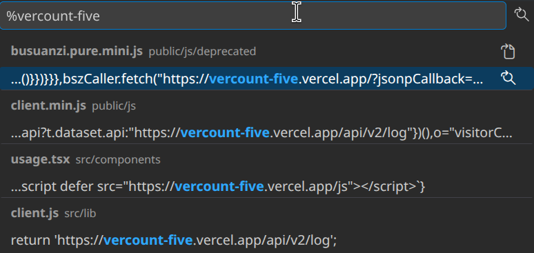
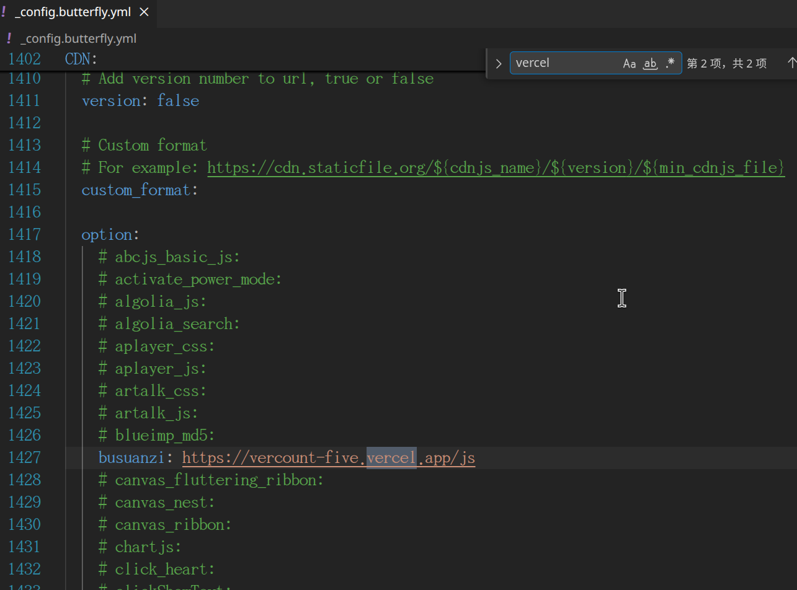
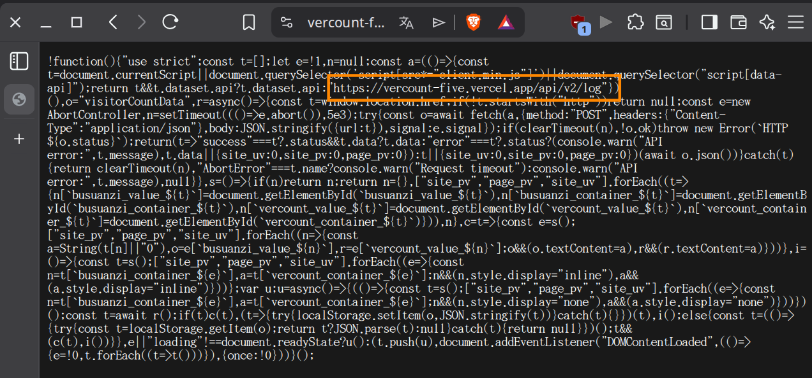
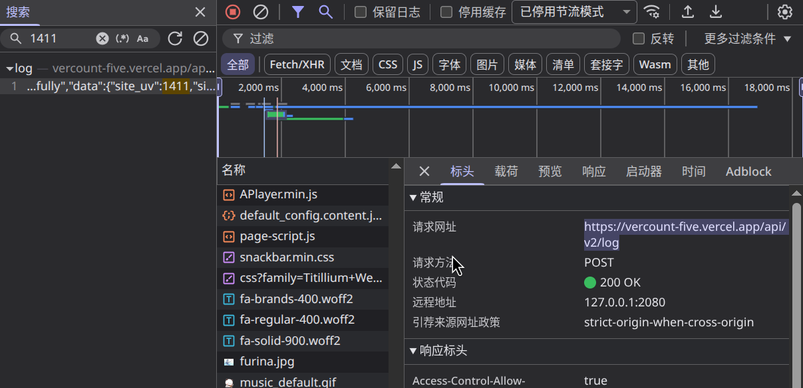
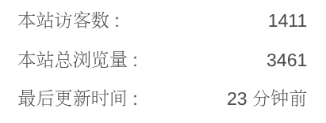

# 部署教程

直接fork我这个仓库，和原仓库比，改了一些东西，我也忘了改动的什么了，许久之前干的了

然后上vercel部署。直接部署会存在问题，把报错丢给gemini，会发现环境变量少东西

把这些都补全即可

- `GITHUB_CLIENT_ID` 和 `GITHUB_CLIENT_SECRET`：
https://github.com/settings/developers
- `DATABASE_URL`：https://console.neon.tech/app/projects/create
- `KV_REST_API_URL` 和 `KV_REST_API_TOKEN`：https://console.upstash.com/redis/create
- **`BETTER_AUTH_URL`**: https://你的项目名.vercel.app
- **`BETTER_AUTH_SECRET`**：脸滚键盘随便打一串乱码，越长越好 (比如：`Kjsd823_sakd9238jdk_random_string`)

然后重新部署

你还要在仓库里自己改一下代码。怎么改？很简单，直接替换我项目里的`vercount-five`，变为你的vercel的url即可

最后关联进你的博客即可（我用的是butterfly）

然后重新部署，就有了

如果不行，你可以看看流量包，看看js文件是不是指向你的url（我的js是`https://vercount-five.vercel.app/js`，你可以替换一下看看）

然后点进博客主页，发现有数字了，而且看起来果然继承了之前的

